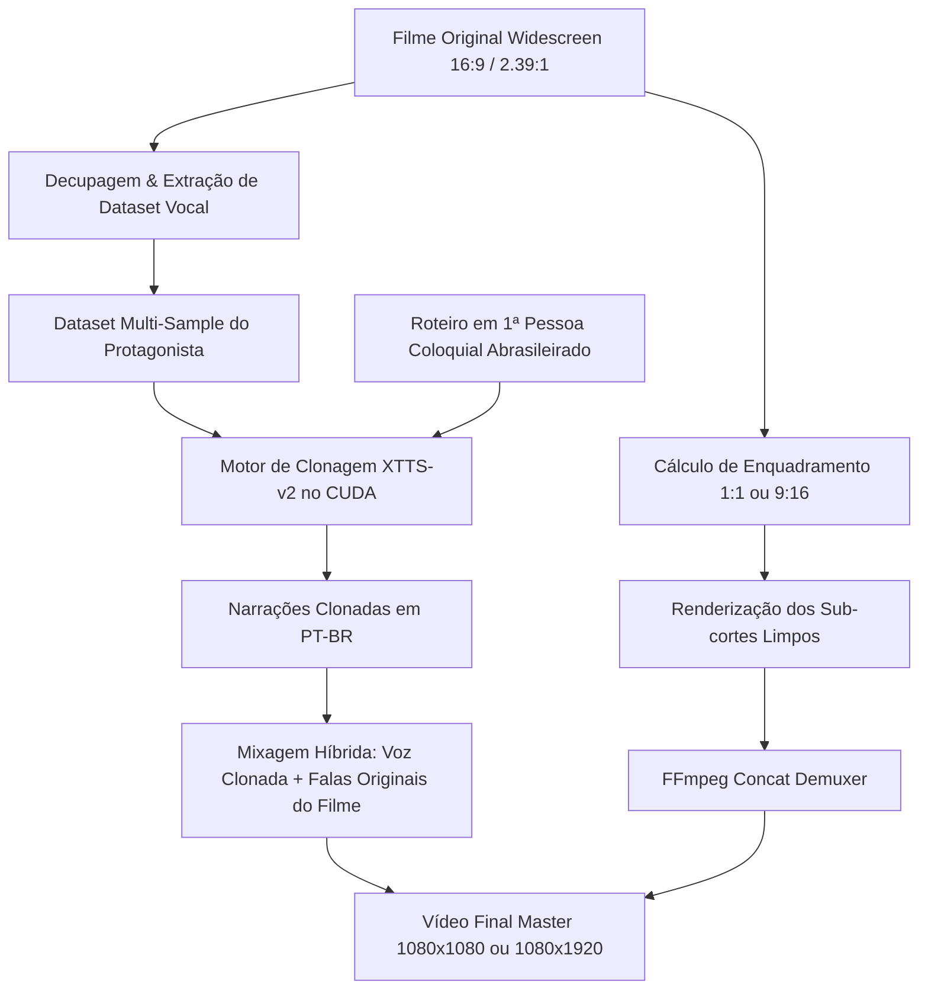

# 🎬 CineShorts Engine | Resumos de Filmes Virais (1:1 & 9:16)

[](https://www.python.org/)
[]()
[](https://ffmpeg.org/)
[](LICENSE)
[]()

> **Motor cinematográfico completo para transformar filmes em vídeos virais de alta retenção para TikTok, Instagram Reels, YouTube Shorts e Facebook Watch.**
> Suporte nativo a formatos **1:1 Quadrado** e **9:16 Vertical**, clonagem neural de voz do protagonista via **XTTS-v2 Multi-Sample**, áudio híbrido intercalado com falas do filme e montagem com **zero repetição de cena**.

---

## 🌟 Principais Recursos

- 📐 **Formatos 1:1 Quadrado & 9:16 Vertical:** O usuário pode alternar entre o formato quadrado (1080x1080) — que preserva o cenário e dois atores conversando simultaneamente — ou tela cheia vertical (1080x1920), com reenquadramento focal automático.
- 🎙️ **Clonagem de Voz Neural Multi-Sample (XTTS-v2):** Extrai amostras de falas reais do protagonista direto do filme e sintetiza a narração em 1ª pessoa reproduzindo com fidelidade o timbre, a ressonância e o sotaque em português brasileiro.
- 🗣️ **Áudio Híbrido Dinâmico:** A narração contextualiza a história com ducking (-22 dB), mas nos momentos de falas marcantes ou socos/tiros, ela silencia e a dublagem original do filme sobe para 100% de volume.
- ✂️ **Regra de Zero Repetição:** Cada corte avança a ação cronológica para a frente sem nunca repetir o mesmo ângulo ou cena que o espectador já viu.
- 🤖 **Integração com Antigravity CLI & Python SDK:** O futuro aplicativo se conecta diretamente ao Antigravity instalado na máquina do usuário para executar roteirização e decupagem em segundo plano com **zero custo de API de LLM**.

---

## 🗺️ Fluxo de Trabalho (Pipeline)



---

## 📂 Estrutura do Repositório

```text
RESUMO-DE-FILME/
├── core/                       # Módulos centrais da engine
│   ├── __init__.py
│   ├── config.py               # Suporte a 1:1, 9:16, áudio híbrido e clonagem
│   ├── focal_tracker.py        # Matemática de crop 1:1 e 9:16
│   ├── voice_clone.py          # Motor XTTS-v2 com multi-sample embeddings
│   ├── video_renderer.py       # Renderizador paralelo e mixer FFmpeg
│   ├── scene_detector.py       # Algoritmos de detecção de cortes
│   ├── screenplay.py           # Análise e métricas de roteiro
│   └── pipeline.py             # Orquestrador mestre
├── docs/                       # Documentação e Roadmap
│   ├── APP_ROADMAP.md          # Blueprint para o Software/App (Antigravity SDK)
│   └── PIPELINE_GUIDE.md       # Guia operacional passo a passo
├── examples/                   # Exemplos práticos completos validados
│   └── homem_aranha/
│       ├── roteiro_narracao.txt
│       ├── legendas.srt
│       ├── mapa_de_cortes.json
│       └── narracao.mp3
├── ARCHITECTURE.md             # Especificação matemática e técnica detalhada
├── cli.py                      # Interface de Linha de Comando (CLI)
├── config.example.json         # Arquivo de configuração de exemplo
├── requirements.txt            # Dependências Python
└── README.md
```

---

## 🚀 Instalação e Execução

### 1. Pré-requisitos
- **Python 3.11**
- **GPU NVIDIA com suporte a CUDA** (testado na RTX 4060 com 8GB VRAM)
- **FFmpeg no PATH**

### 2. Instalar Dependências
```bash
git clone https://github.com/Pierre369/RESUMO-DE-FILME.git
cd RESUMO-DE-FILME

# Criar ambiente virtual
python -m venv .venv
.venv\Scripts\activate

# Instalar dependências
pip install -r requirements.txt
pip install coqui-tts
```

---

## 💻 Como Usar

### 1. Calcular Enquadramento (1:1 ou 9:16)
```bash
python cli.py crop-calc --target-x 960 --orig-w 1920 --orig-h 800
```

### 2. Renderizar Resumo com Voz Clonada
```bash
python render_palmer_cloned_1to1.py
```

---

## 📚 Documentação Adicional

- [📘 Blueprint do Aplicativo / SaaS (docs/APP_ROADMAP.md)](docs/APP_ROADMAP.md): Como conectar o Antigravity via CLI/SDK e estruturar o software comercial.
- [🔬 Especificação Técnica de Arquitetura (ARCHITECTURE.md)](ARCHITECTURE.md): Dedução matemática de crop e filtros FFmpeg.
- [📘 Guia Completo da Pipeline (docs/PIPELINE_GUIDE.md)](docs/PIPELINE_GUIDE.md): Passo a passo detalhado de montagem e retenção.

---

## 📄 Licença

Distribuído sob a licença MIT. Consulte `LICENSE` para mais informações.
