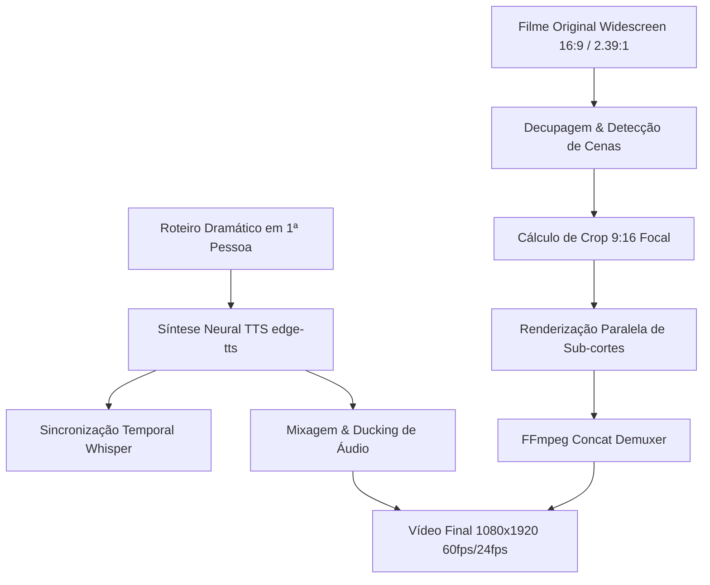

# 🎬 CineShorts Engine | Resumo de Filme Vertical (9:16)

[](https://www.python.org/)
[](https://ffmpeg.org/)
[](LICENSE)
[]()

> **Motor cinematográfico completo para transformar longas-metragens em vídeos verticais (1080x1920) de alta retenção para TikTok, Instagram Reels e YouTube Shorts.**
> Narração envolvente em primeira pessoa, enquadramento dinâmico dos sujeitos e mixagem imersiva com o áudio original do filme.

---

## 🌟 Principais Recursos

- 📐 **Enquadramento 9:16 Dinâmico (Focal Centering):** Preenchimento 100% da tela (sem barras pretas), mantendo os rostos, atores e objetos principais perfeitamente centralizados em cada plano.
- 🎭 **Storytelling em 1ª Pessoa:** Roteirização cinematográfica contada pelo próprio protagonista/antagonista com estrutura em 3 atos.
- 🎙️ **Síntese de Voz Neural:** Integração com vozes neurais da Microsoft (`edge-tts`), calibradas para cadência dramática (-9% de velocidade).
- 🔊 **Sound Design com Ducking:** A ambiência, os passos, os tiros e a trilha do filme continuam audíveis ao fundo (-22 dB), criando uma experiência imersiva com a narração em primeiro plano.
- ⚡ **Renderização Multi-Thread:** Segmentação em sub-cortes processados em paralelo pelo FFmpeg e unidos com precisão sem perda de qualidade via *concat demuxer*.
- 🚀 **Pronto para Virar App:** Arquitetura limpa e desacoplada em módulos Python, ideal para servir de backend em um SaaS Web ou Desktop App.

---

## 🗺️ Fluxo de Trabalho (Pipeline)



---

## 📂 Estrutura do Repositório

```text
RESUMO-DE-FILME/
├── core/                       # Módulos centrais da engine
│   ├── __init__.py
│   ├── config.py               # Dataclasses de configuração (Vídeo, Áudio, TTS)
│   ├── focal_tracker.py        # Matemática de centralização e crop 9:16
│   ├── pipeline.py             # Orquestrador mestre do fluxo
│   ├── scene_detector.py       # Algoritmos de corte e detecção de transições
│   ├── screenplay.py           # Análise e validação dramática de roteiro
│   ├── subtitle_sync.py        # Alinhamento de legendas via Whisper
│   ├── tts_engine.py           # Gerador de voz neural (Edge-TTS)
│   └── video_renderer.py       # Renderizador paralelo e mixer FFmpeg
├── docs/                       # Documentação aprofundada
│   ├── APP_ROADMAP.md          # Especificação para construir SaaS / App Desktop
│   └── PIPELINE_GUIDE.md       # Guia operacional passo a passo para editores
├── examples/                   # Exemplo prático completo validado
│   └── homem_aranha/
│       ├── roteiro_narracao.txt
│       ├── legendas.srt
│       ├── mapa_de_cortes.json
│       ├── mapa_de_cortes.csv
│       └── narracao.mp3
├── ARCHITECTURE.md             # Especificação matemática e técnica detalhada
├── cli.py                      # Interface de Linha de Comando (CLI)
├── config.example.json         # Arquivo de configuração de exemplo
├── requirements.txt            # Dependências Python
└── README.md
```

---

## 🚀 Instalação e Pré-requisitos

### 1. Pré-requisitos do Sistema
- **Python 3.10 ou superior**
- **FFmpeg instalado e acessível no PATH do sistema** (verifique executando `ffmpeg -version`)

### 2. Clonar o Repositório e Instalar Dependências
```bash
git clone https://github.com/Pierre369/RESUMO-DE-FILME.git
cd RESUMO-DE-FILME

# Criar e ativar ambiente virtual
python -m venv .venv
# No Windows:
.venv\Scripts\activate
# No Linux/macOS:
source .venv/bin/activate

# Instalar dependências
pip install -r requirements.txt
```

---

## 💻 Como Usar (CLI)

O projeto conta com uma ferramenta CLI (`cli.py`) completa:

### 1. Validar Métrica do Roteiro
Analisa a quantidade de palavras, tempo estimado de fala e ritmo:
```bash
python cli.py script-check --script examples/homem_aranha/roteiro_narracao.txt
```

### 2. Gerar a Narração com Voz Neural
Gera o áudio com a voz neural configurada e velocidade cinematográfica:
```bash
python cli.py tts --script examples/homem_aranha/roteiro_narracao.txt --output narracao.mp3 --voice pt-BR-AntonioNeural --rate "-9%"
```

### 3. Calcular Coordenadas de Enquadramento 9:16
Calcula instantaneamente o parâmetro `crop_x` do FFmpeg para centralizar o ponto de interesse:
```bash
python cli.py crop-calc --target-x 960 --orig-w 1920 --orig-h 1080
# Saída esperada: crop_x = 1140 (centralizado perfeitamente no frame 1080x1920)
```

### 4. Renderizar o Vídeo Final Completo
Executa o corte de todos os takes, reenquadramento 9:16, mixagem com ducking de som do filme e exportação:
```bash
python cli.py render --movie "FILME/meu_filme.mp4" --cut-map "mapa_de_cortes.json" --audio "narracao.mp3" --output "video_final_vertical.mp4" --threads 4
```

---

## 📚 Documentação Adicional

- [📘 Guia Completo da Pipeline (docs/PIPELINE_GUIDE.md)](docs/PIPELINE_GUIDE.md): Passo a passo detalhado de edição, ritmo e enquadramento.
- [🔬 Especificação Técnica de Arquitetura (ARCHITECTURE.md)](ARCHITECTURE.md): Dedução matemática das matrizes de crop, filtros FFmpeg e ducking.
- [📱 Blueprint do Aplicativo / SaaS (docs/APP_ROADMAP.md)](docs/APP_ROADMAP.md): Estrutura recomendada de banco de dados, frontend e IA para transformar este projeto em um software comercial.

---

## 📄 Licença

Distribuído sob a licença MIT. Consulte `LICENSE` para mais informações.
